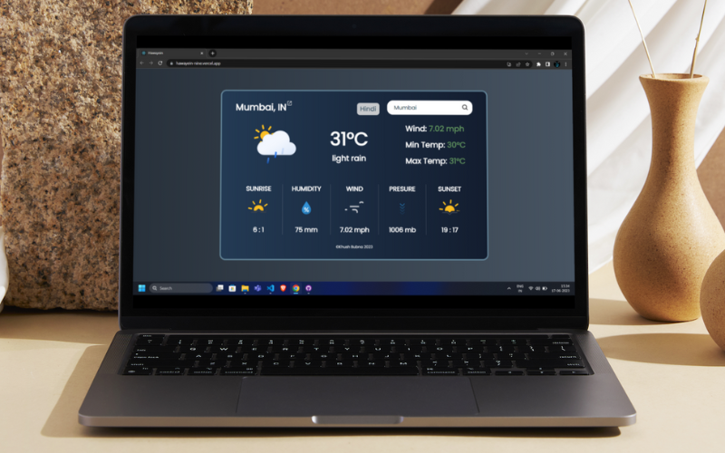

# Hawayein : Your Personal Weather Assistant
 
A weather app designed to provide users with up-to-date information on current and forecasted weather conditions. Provides data on temperature, precipitation, wind speed and direction and humidity.

Technology: ReactJs, VITE, OpenWeatherAPI, NodeJs.

ALso available local Indian language.

Live Demo: https://hawayein-nine.vercel.app/

 
